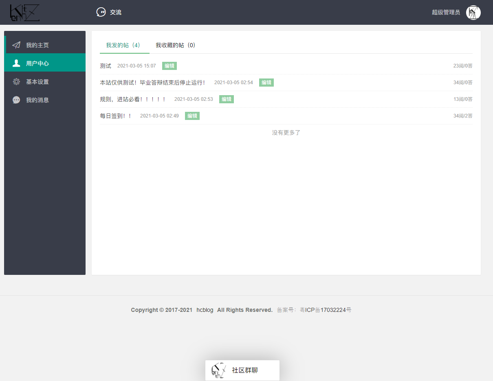

# hcwblog
hcblog（博客论坛双用系统）

## 项目介绍
本次系统的目标为设计并开发一个以分布式技术为基础的高性能论坛系统。结合现有的流行论坛的业务需求，使用多种开源框架技术以及数据库作为技术架构。  
系统架构使用经典的MVC模式，前端使用Freemarker模板引擎结合基于Layui的fly3.0模板。后端使用基于JAVA语言的SpringBoot2框架集合，Mybatis-Plus等技术。权限校验使用shiro框架，数据存储使用关系型数据MYSQL作为永久性存储、使用Key-Value数据库Redis作为缓存数据库以提高系统的并发量。图片资源使用七牛云做CDN降低服务器带宽消耗。  
本系统的设计有以下功能：登录、注册、发表帖子、编辑帖子、收藏帖子、评论帖子、删除帖子、消息通知、用户中心、用户信息修改，实时消息通知，im系统等。

## 使用平台
JDK 1.8 + Tomcat 9.0 + MySQL 5.7 + RabbitMQ 3.8 + Elasticsearch 7.10

## 技术架构
核心框架：Springboot 2.3.1  
安全框架：Apache Shiro 1.4  
持久层框架：Mybatis-Plus 3.3.2  
页面模板：Freemarker
数据库：Mysql 5.7 Redis 5.0.5  
消息队列：RabbitMQ 3.8.10-rc.6  
分布式搜索：Elasticsearch 7.10.2  
双工通讯协议：WebSocket  
网络通讯框架：T-io 3.6.0.v20200315-RELEASE  
工具集合：HuTool 5.3.9  
第三方api：七牛云 7.3.0, 7.3.99  百度aip 4.15.3

## 源码运行教程

1. 修改src/main/resources/templates/include/footer.ftlh的备案信息
2. 修改src/main/resources/static/js/im.js的let url的链接
3. 修改src/main/resources/application.yml将所有带xxxxx改为自己的数据

## 前端展示

### 开发采坑笔记
- 2020-09-03  
数据库最新文章（post表）为20200901，20200902，20200903，缓存到mysql时却出现了day:rank:20200904。
查看centos时间为2020年 08月 18日 星期二 10:22:39 CST ，后使用 ntpdate ntp.ntsc.ac.cn更新北京时间，依旧出现04的记录，
初步怀疑是mysql，输入命令SHOW VARIABLES LIKE "%time_zone%";发现time_zone为SYSTEM，初步排除系统时间与mysql导致的时间错误。
最后发现是datasource的URL上使用serverTimezone=UTC，后将UTC改为Asia/Shanghai成功解决问题

- 2020-10-17  
七牛云上传token的过期时间为3600秒，未设置定时任务进行刷新，导致服务启动一小时后上传失败

- 2020-10-19  
上传头像接口出现  
NoSuchFileException: D:\Temp\undertow.1785867929502475879.8080\undertow2146949036606445489upload  
出现异常的原因是系统将D盘的临时目录清理后项目无法找到临时目录导致异常的发生，使用undertow无法自行设置临时目录，更改为tomcat容器后自行设置临时目录即可正常使用
  
- 2020-12-24
将/collection/find配置到shiro拦截列表中使用postman发送请求拦截失败。 
经过测试/collection/find拦截成功跳转登录页，使用/collection/find/则拦截失败，原因是存放拦截列表的map没有/collection/find/